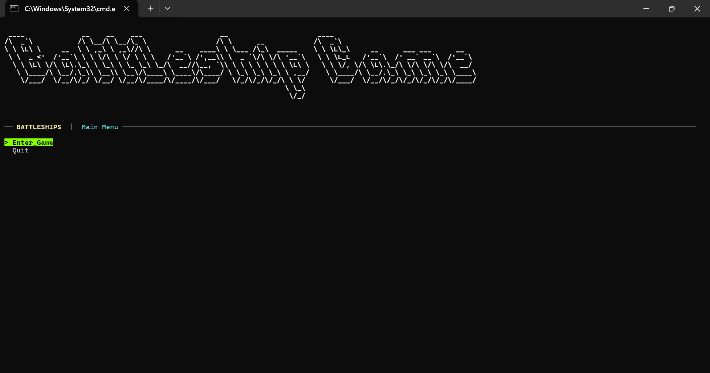
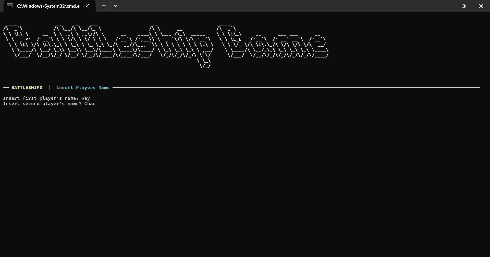
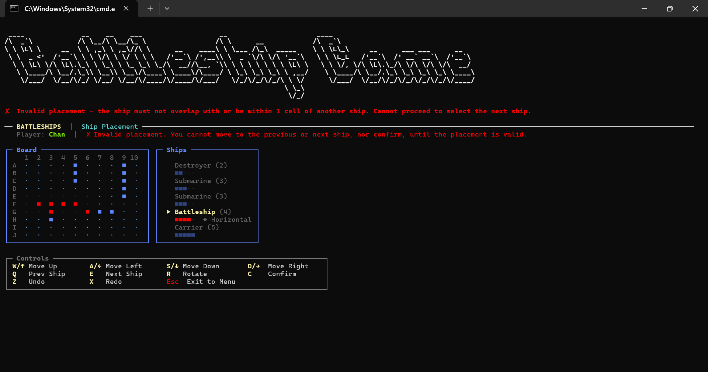
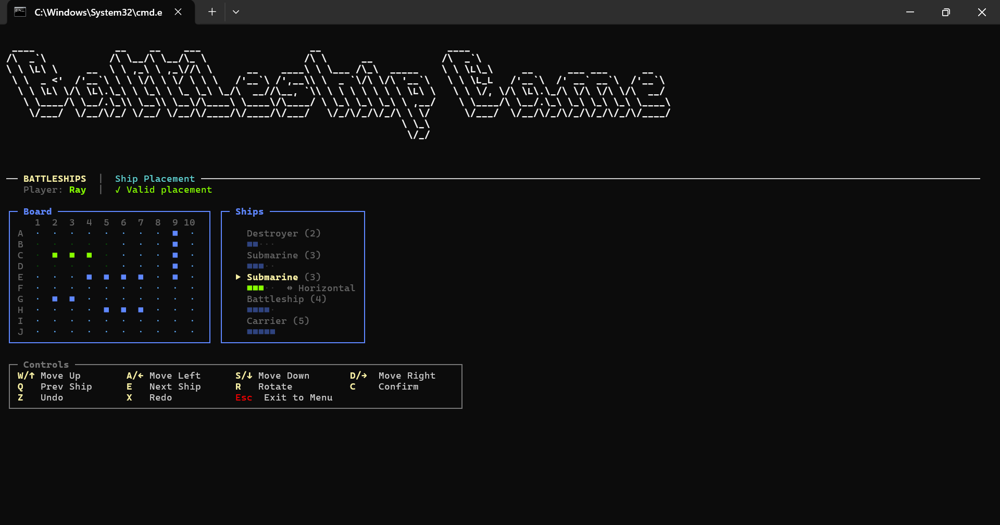
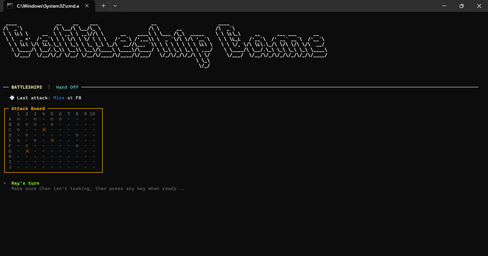
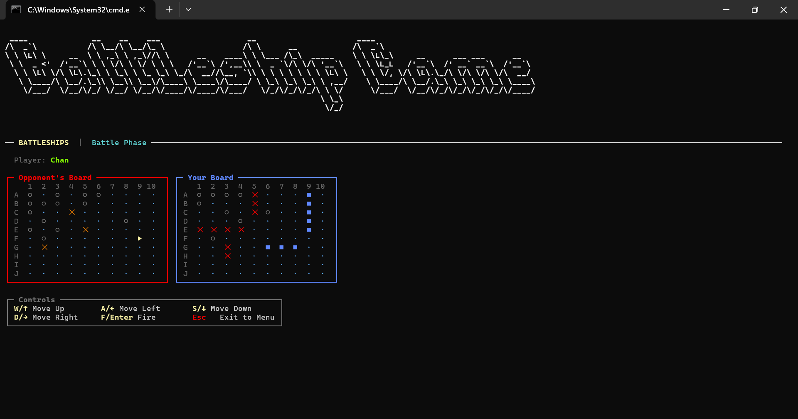
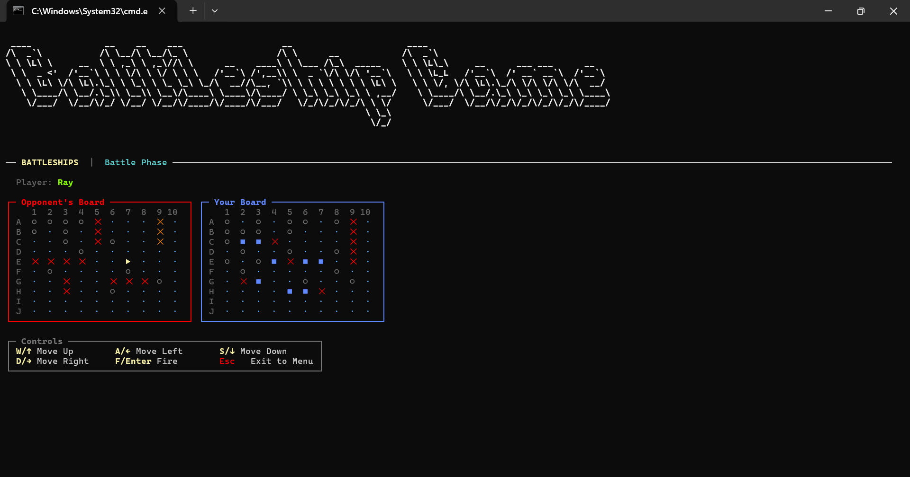
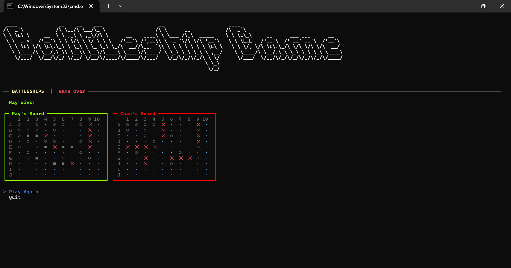

# Battleships

A .NET 8 console version of Battleships, built with Spectre.Console for the terminal UI. Two players place ships on a 10x10 grid and take turns firing at coordinates until one fleet is sunk.

## Gameplay

| | |
|---|---|
|  |  |
|  |  |
|  |  |
|  |  |

## Running

```bash
dotnet restore
dotnet build
dotnet run
```
